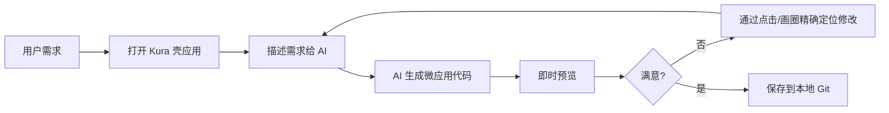

# 结构化笔记 - Kura (蔵) 项目

> 从 `brainstorm.md` 提取并分类的结构化信息
>
> 生成时间: 2025-01-16

---

## 维度一: 业务 / 价值 (Business / Value)

### 1.1 痛点 (Pain Points)

#### 当前软件行业的空白
| 问题 | 描述 | 影响 |
|------|------|------|
| 长尾需求无法满足 | 通用软件 (Excel, Notion) 只满足 80% 需求，剩下 20% 极度个性化 | 用户被迫妥协或寻找昂贵定制方案 |
| SaaS 隐私风险 | 数据上传到云端，无法掌控 | 企业/个人不敢使用敏感数据 |
| 开发成本高 | 为单一用户开发单一功能经济上不可行 | 很多小需求永远无法实现 |
| 工具孤岛 | 各软件功能无法协同工作 | 用户被厂商流程束缚 |

#### 传统开发方式的痛点
| 痛点 | 描述 |
|------|------|
| Node.js 臃肿 | `node_modules` 黑洞、启动慢、内存占用高 |
| 构建工具复杂 | Webpack/Vite 配置繁琐，学习曲线陡峭 |
| 前后端边界模糊 | AI 易混淆浏览器 API 和 Node.js API |
| AI 代码生成上下文大 | 大型项目代码量巨大，AI 难以维护 |

### 1.2 核心交互 (Core Interaction)

#### 用户工作流


#### AI 辅助开发交互
| 交互方式 | 适用场景 | 实现难度 |
|----------|----------|----------|
| 纯文本对话 | 简单需求、整体重构 | 低 |
| DOM 锚定 (点击元素) | 精准修改特定组件 | 低 ⭐ 推荐 |
| 视觉锚定 (截图画圈) | 布局调整、美感优化 | 中 |

### 1.3 价值主张 (Value Proposition)

| 价值维度 | 具体体现 | 竞争优势 |
|----------|----------|----------|
| **即时性** | AI 生成，秒级可用 | vs 传统开发周级 |
| **隐私保护** | 本地优先，数据不上传 | vs SaaS 产品 |
| **轻量化** | 30-90MB 打包体积 | vs Electron 150MB+ |
| **模块化** | 公共模块复用 | vs 独立工具无法共享 |
| **Git 原生** | 代码即仓库，同步即分享 | vs 专有格式 |

### 1.4 目标用户
| 用户类型 | 需求 | 使用场景 |
|----------|------|----------|
| 极客/开发者 | 快速构建个人工具箱 | 格式转换、正则提取、数据清洗 |
| 中小企业 | 私有数据处理 | 本地 ERP、库存管理、报表生成 |
| 效率工具爱好者 | 个性化工作流 | 待办清单、时间追踪、知识管理 |
| AI Agent 用户 | AI 自动化执行 | AI 生成脚本完成任务 |

---

## 维度二: 技术 / 架构 (Technical / Architecture)

### 2.1 数据流 (Data Flow)

#### 完整请求链路
```
[用户点击]
    ↓
[浏览器 - 壳应用前端] (dashboard.html)
    ↓ GET /apps/calc/index.html
[网络请求]
    ↓
[Bun 后端] (server.js)
    ↓ 读取文件 + 注入头部
[网络响应]
    ↓
[浏览器 - 微应用] (加载在 iframe 里)
    ↓ 渲染界面 + 运行 logic.js
[用户看到]
```

#### 文件读取流程
```javascript
// 浏览器端 (logic.js) - 无文件权限
const response = await fetch('/api/get-file?name=data.txt');
const text = await response.text();
this.content = text;

// Bun 后端 (server.js) - 有文件权限
if (url.pathname === '/api/get-file') {
    const file = Bun.file('./workspace/data.txt');
    return new Response(file);
}
```

### 2.2 关键组件 (Key Components)

#### 后端组件 (Bun)
| 组件 | 职责 | API |
|------|------|-----|
| HTTP Server | 处理所有请求 | `Bun.serve()` |
| File System | 读写文件 | `Bun.file()`, `Bun.write()` |
| Process Manager | 启动浏览器/WebView | `Bun.spawn()` |
| Config Manager | 管理工作区配置 | `vibe-config.json` |

#### 前端组件 (Browser)
| 组件 | 职责 | 技术 |
|------|------|------|
| Shell UI | 标签页管理、应用导航 | Alpine.js |
| Iframe Container | 微应用隔离容器 | HTML Iframe |
| Import Maps | 模块路径映射 | 浏览器原生 |
| AI Chat Panel | AI 交互界面 | 待实现 |

#### 微应用组件
| 组件 | 职责 | 技术 |
|------|------|------|
| View Layer | UI 渲染 | Tailwind + DaisyUI |
| Logic Layer | 状态管理与业务逻辑 | Alpine.js + ES Modules |
| Style Layer | 自定义样式 | CSS (可选) |

### 2.3 约束条件 (Constraints)

#### 安全约束
| 约束 | 描述 | 应对 |
|------|------|------|
| 浏览器沙箱 | 前端无法直接读写文件 | 通过 Bun API 中转 |
| 同源策略 | Iframe 间通信受限 | 同源设计，支持 `postMessage` |
| CORS 限制 | 本地文件访问受限 | Bun 提供 HTTP 服务 |

#### 性能约束
| 约束 | 目标 | 应对 |
|------|------|------|
| 启动速度 | < 2秒 | Bun + JSC 引擎 |
| 内存占用 | < 100MB (空载) | Bun 轻量设计 |
| 并发支持 | > 100 Tab | Bun 高并发处理 |

#### 兼容性约束
| 平台 | 支持情况 | 备注 |
|------|----------|------|
| Windows 10/11 | ✅ 完全支持 | WebView2 内置 |
| macOS | ✅ 完全支持 | WebKit/Safari |
| Linux | ⚠️ 部分支持 | 需手动安装依赖 |
| Chrome/Edge | ✅ 完全支持 | |
| Firefox/Safari | ⚠️ File System API 有限 | |

---

## 维度三: 规范 / 约束 (Specs / Constraints)

### 3.1 输入/输出 (Input/Output)

#### 微应用输入格式
```javascript
// logic.js 标准格式
export default () => ({
    // 必须返回一个对象
    state: 'value',
    method() { /* ... */ }
});
```

#### 微应用输出格式
```html
<!-- index.html 标准格式 -->
<div x-data="app" class="p-4">
    <!-- 使用 Tailwind 类名 -->
    <!-- 使用 Alpine 指令 -->
</div>
```

#### API 请求格式
```javascript
// 获取文件
GET /api/read?path=apps/calculator/index.html

// 保存文件
POST /api/save
{
  "path": "apps/calculator/logic.js",
  "content": "export default () => ({ ... })"
}

// 获取工作区
GET /api/workspace
POST /api/workspace
{
  "path": "D:/MyProjects"
}
```

### 3.2 目录结构规范 (Directory Structure)

#### 强制结构
```
/workspace (可配置)
├── apps/              # 微应用目录
│   └── {app-name}/
│       ├── index.html # 必需
│       ├── logic.js   # 必需
│       └── style.css  # 可选
├── shared/            # 公共模块 (可选)
│   └── *.js
└── vibe-config.json   # 工作区配置
```

#### 文件命名约定
| 类型 | 命名规范 | 示例 |
|------|----------|------|
| 微应用目录 | 小写字母+连字符 | `my-calculator`, `todo-list` |
| 逻辑文件 | `logic.js` | 固定命名 |
| 样式文件 | `style.css` | 固定命名 |
| 配置文件 | `vibe-config.json` | 固定命名 |

### 3.3 错误处理 (Error Handling)

#### 前端错误处理
```javascript
// 捕获微应用错误
window.onerror = (msg, url, line, col, error) => {
    // 发送给 AI 用于修复
    sendToAI({
        type: 'error',
        message: msg,
        context: getCurrentContext()
    });
};
```

#### 后端错误处理
| 错误类型 | HTTP 状态 | 处理方式 |
|----------|-----------|----------|
| 文件不存在 | 404 | 返回友好提示 |
| 权限拒绝 | 403 | 记录日志，提示用户 |
| 服务器错误 | 500 | 返回错误详情 (开发模式) |

### 3.4 代码规范 (Code Standards)

#### Alpine.js 规范
```javascript
// ✅ 正确 - 导出函数
export default () => ({
    count: 0,
    increment() { this.count++; }
});

// ❌ 错误 - 导出对象
export const app = {
    count: 0,
    increment() { this.count++; }
};
```

#### Import 规范
```javascript
// ✅ 正确 - 使用虚拟路径
import { utils } from '@shared/helpers.js';

// ❌ 错误 - 使用相对路径
import { utils } from '../../../shared/helpers.js';
```

#### 样式规范
```html
<!-- ✅ 正确 - 使用 Tailwind -->
<div class="p-4 bg-blue-500 text-white">...</div>

<!-- ❌ 错误 - 内联样式 -->
<div style="padding: 1rem; background: blue;">...</div>
```

---

## 附录: 技术决策记录

### A.1 为什么选 Bun 而非 Node.js?
| 维度 | Bun | Node.js |
|------|-----|---------|
| 启动速度 | 毫秒级 | 秒级 |
| 内存占用 | 10-30MB | 50-100MB+ |
| 打包体积 | 30-90MB | 150MB+ (Electron) |
| API 设计 | 现代 | 历史包袱 |
| TypeScript | 原生支持 | 需配置 |

### A.2 为什么选 Alpine.js 而非 React/Vue?
| 维度 | Alpine.js | React/Vue |
|------|-----------|-----------|
| 文件大小 | ~15KB | ~100KB+ |
| 编译需求 | 无 | 需要 JSX/编译器 |
| 学习曲线 | 极低 | 中等 |
| 适合场景 | 小型组件 | 大型 SPA |

### A.3 为什么使用 Import Maps?
| 优势 | 说明 |
|------|------|
| 浏览器原生 | 无需 polyfill 或构建工具 |
| 路径解耦 | 重构不影响代码 |
| 标准化 | W3C 标准，未来兼容 |
| AI 友好 | 清晰的模块边界 |

---

*文档版本: 1.0*
*提取源文件: `seek/kura/brainstorm.md`*
*分类方法: 三维框架 (业务/技术/规范)*
