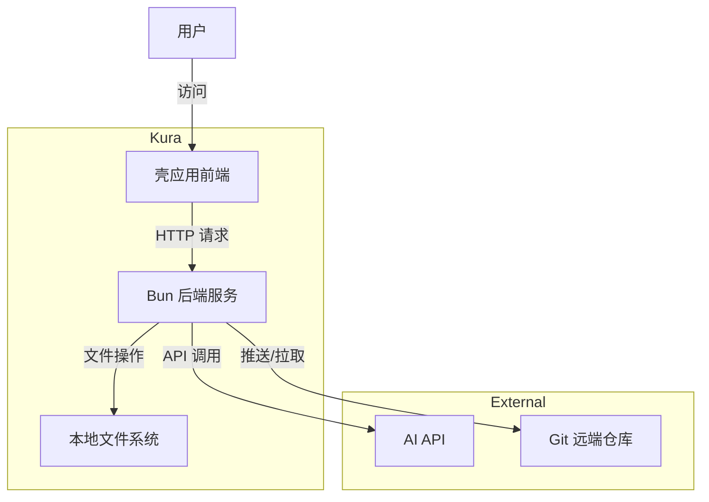
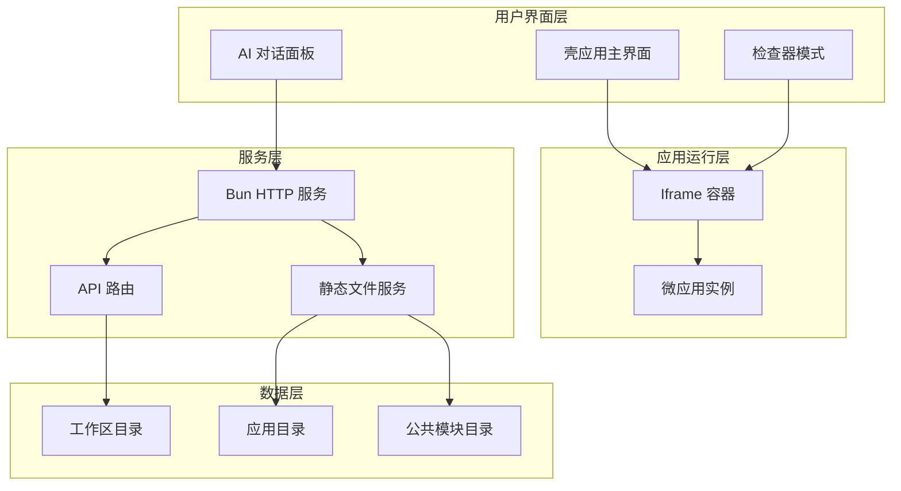
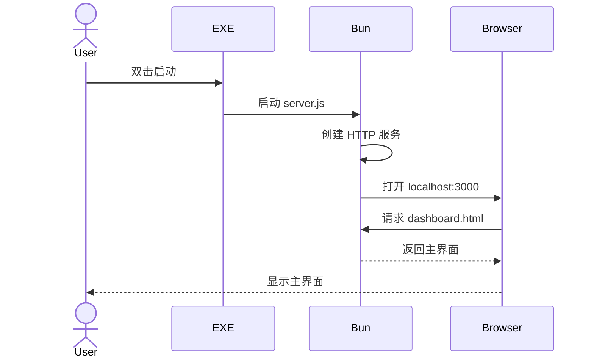
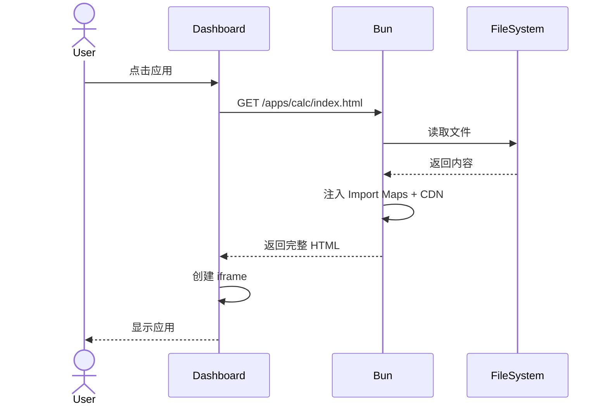
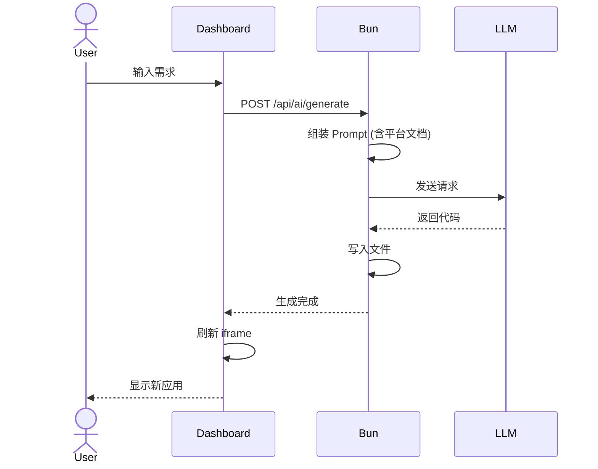
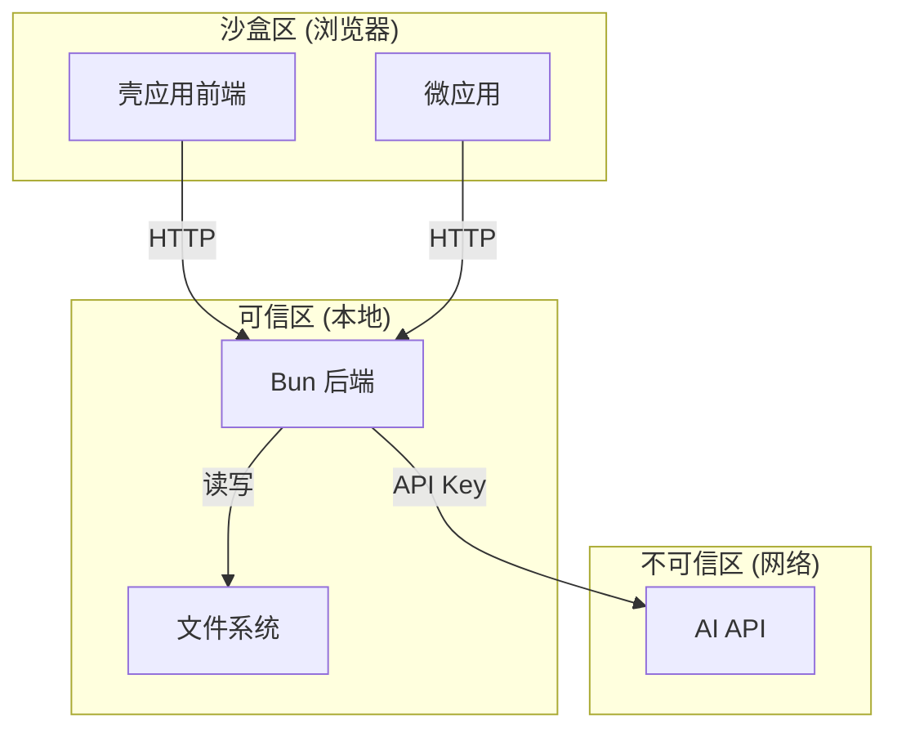
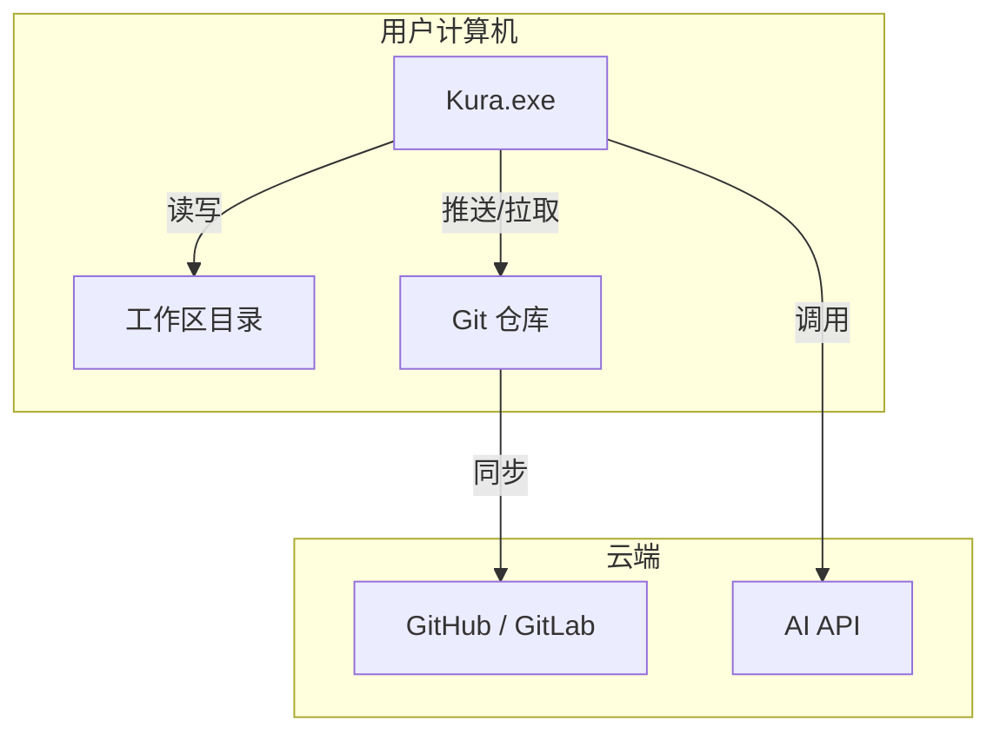

# System Architecture Design

**Document Version:** 1.0
**Last Updated:** 2026-01-17
**Status:** DRAFT
**Project Name:** Kura (蔵) - 本地化微应用生成与运行平台

---

## 1. Overview

### 1.1 System Purpose

Kura 是一个基于浏览器的本地优先微应用平台，由 Bun 后端服务和 Web 前端组成。系统通过 AI 生成符合标准化规范的微应用代码，并在本地文件系统中管理和运行这些应用。系统的核心价值在于让用户能够快速创建满足个人特定需求的小型工具，同时保持数据隐私和安全。

### 1.2 Scope

**包含：**
- 微应用的 AI 生成和修改
- 多标签页应用管理和运行
- 本地文件系统的读写操作
- 公共模块 (@shared) 的管理和引用
- Git 版本控制和同步

**不包含：**
- 云端数据存储
- 多用户协作功能
- 用户认证和权限管理

### 1.3 Design Principles

- **本地优先**: 所有数据存储在本地，保护用户隐私
- **零依赖**: 无需 Node.js、无需构建流程，开箱即用
- **标准化**: 统一的目录结构和技术栈，降低复杂度
- **AI 友好**: 微应用设计为小而美，便于 AI 理解和生成
- **模块化**: 通过 Import Maps 实现代码复用

---

## 2. High-Level Architecture

### 2.1 System Context



### 2.2 Component Overview



### 2.3 Technology Stack

| 层级 | 技术 | 版本 | 用途 |
|------|------|------|------|
| **运行时** | Bun | Latest | JavaScript 运行时和 HTTP 服务 |
| **前端框架** | Alpine.js | 3.x | 轻量级响应式框架 |
| **样式库** | Tailwind CSS | 3.x | 实用优先的 CSS 框架 |
| **组件库** | DaisyUI | Latest | Tailwind 组件库 |
| **模块系统** | Import Maps | - | 浏览器原生模块映射 |
| **打包工具** | Bun Build | - | 编译成独立 EXE |
| **WebView** | Electrobun / Edge --app | - | 原生窗口包装 |

---

## 3. Component Design

### 3.1 Bun 后端服务 (server.js)

**目的:** 提供 HTTP 服务、文件操作、AI API 调用

**职责:**
- 启动 HTTP 服务器 (端口 3000)
- 处理静态文件请求
- 提供 API 接口 (文件读写、应用列表)
- 代理 AI API 请求
- 执行 Git 命令
- 自动打开浏览器窗口

**接口:**

| 接口 | 类型 | 描述 |
|------|------|-------------|
| GET / | API | 返回壳应用主界面 |
| GET /apps/:name/index.html | API | 动态拼接完整 HTML |
| GET /apps/:name/logic.js | API | 返回应用 JS 文件 |
| GET /api/shared/* | API | 映射到公共模块目录 |
| POST /api/save | API | 保存文件到本地 |
| POST /api/ai/generate | API | 调用 AI 生成代码 |
| GET /api/apps | API | 获取应用列表 |

**依赖:**
- Node.js 标准库 (fs, path, child_process)
- Bun 内置 API (Bun.file, Bun.write, Bun.serve)

### 3.2 壳应用前端 (dashboard.html)

**目的:** 提供用户界面，管理微应用生命周期

**职责:**
- 渲染多标签页界面
- 管理 AI 对话面板
- 实现 DOM 锚定功能
- 控制 iframe 显示和隐藏

**接口:**

| 接口 | 类型 | 描述 |
|------|------|-------------|
| openApp(id, name, url, icon) | Function | 打开微应用 |
| closeTab(id) | Function | 关闭标签页 |
| enableInspector() | Function | 启用检查器模式 |
| sendToAI(prompt, context) | Function | 发送请求给 AI |

**依赖:**
- Alpine.js
- Tailwind CSS
- DaisyUI

### 3.3 微应用标准模板

**目的:** 定义微应用的统一结构

**职责:**
- 提供标准化的 HTML 结构
- 导出业务逻辑 (ES Module)
- 可选的自定义样式

**结构:**
```
{app-name}/
├── index.html    # HTML + Tailwind 类 + Alpine 绑定
├── logic.js      # 纯业务逻辑 (ES Module export)
└── style.css     # (可选) 自定义样式
```

**依赖:**
- @shared 模块 (通过 Import Maps 引用)
- @app/logic (相对路径引用)

### 3.4 @shared 模块系统

**目的:** 提供公共代码复用机制

**职责:**
- 存储可复用的工具函数
- 提供统一的 API 调用封装
- 管理主题配置

**映射规则:**
```
/api/shared/*.js  →  /workspace/shared/*.js
```

**包含模块:**
- `date-utils.js` - 日期处理工具
- `ai-sdk.js` - AI 调用封装
- `theme.js` - 主题配置

### 3.5 AI 生成引擎

**目的:** 理解用户需求并生成符合规范的代码

**职责:**
- 解析用户需求描述
- 生成 Alpine.js + Tailwind 代码
- 处理错误反馈并修正

**约束:**
- 必须使用 Alpine.js 语法
- 必须使用 Tailwind 类
- 必须导出 ES Module
- 不能使用 Node.js API
- 不能直接读写文件

### 3.6 WebView 包装器

**目的:** 将 Web 应用打包成原生程序

**职责:**
- 启动 Bun 后台服务
- 创建原生窗口
- 加载 Web 界面
- 处理窗口事件

**方案:**
- 短期: Edge --app 模式
- 长期: Electrobun

---

## 4. Data Architecture

### 4.1 Data Flow

#### 启动流程


#### 微应用加载流程


#### AI 生成流程


### 4.2 Data Models

| 实体 | 属性 | 关系 |
|--------|------------|---------------|
| **应用** | id, name, icon, url, path | 包含多个文件 |
| **标签页** | id, name, url, icon | 关联一个应用 |
| **模块** | name, path, exports | 被多个应用引用 |
| **工作区配置** | workspace, createdAt, updatedAt | 配置文件 |

### 4.3 State Management

| 状态类型 | 存储 | 作用域 | 生命周期 |
|----------|---------|-------|-----------|
| **标签页状态** | Alpine.js data | 壳应用 | 会话级 |
| **应用状态** | Alpine.js data | 单个 iframe | 会话级 |
| **工作区配置** | JSON 文件 | 系统级 | 持久化 |
| **应用代码** | 文件系统 | 工作区 | 持久化 |

---

## 5. Communication Protocols

### 5.1 Inter-Component Communication

| 类型 | 协议 | 格式 | 用途 |
|------|----------|--------|----------|
| 同步 | HTTP/1.1 | JSON | API 调用 |
| 异步 | fetch API | JSON | AI 生成 |
| 事件 | postMessage | JSON | 跨 iframe 通信 |

### 5.2 External Interfaces

| 系统 | 协议 | 认证方式 | 数据格式 |
|--------|----------|----------------|-------------|
| AI API | HTTPS | API Key (Bearer Token) | JSON |
| Git | SSH/HTTPS | SSH Key / Token | - |

---

## 6. Security Architecture

### 6.1 Security Boundaries



### 6.2 Authentication & Authorization

| 机制 | 使用方 | 目的 |
|-----------|---------|---------|
| API Key | AI API | 验证用户身份 |
| 无 | 本地服务 | 无需认证 (本地环境) |

### 6.3 Data Protection

| 数据类型 | 保护方式 | 存储 |
|-----------|-------------------|---------|
| 应用代码 | 本地文件系统 | /workspace/apps/ |
| API Key | 环境变量 / 配置文件 | 用户本地 |
| 对话历史 | 可选加密 | /workspace/.history/ |

### 6.4 Security Controls

- 浏览器沙箱隔离微应用
- 文件操作只能通过 Bun 后端进行
- AI API Key 不记录在日志中
- 支持用户自定义工作区路径

---

## 7. Deployment Architecture

### 7.1 Deployment Model



### 7.2 Infrastructure Requirements

| 组件 | CPU | 内存 | 存储 | 网络 |
|-----------|-----|--------|---------|---------|
| Bun 后端 | < 5% | ~30MB | ~100MB | 本地回环 |
| 单个微应用 | < 5% | ~20MB | < 1MB | - |
| 壳应用 | < 5% | ~50MB | ~10MB | - |

### 7.3 Scalability Strategy

| 方面 | 水平扩展 | 垂直扩展 |
|--------|------------|----------|
| 应用数量 | 无限制 (受内存限制) | 单机最多 ~50 个标签 |
| 模块数量 | 无限制 | 单个工作区 ~100 个模块 |

---

## 8. Reliability & Availability

### 8.1 Failure Scenarios

| 故障类型 | 影响 | 缓解措施 |
|--------------|--------|------------|
| Bun 服务崩溃 | 无法访问应用 | 自动重启机制 |
| AI API 超时 | 无法生成代码 | 重试机制 + 错误提示 |
| 文件损坏 | 应用无法加载 | Git 版本回退 |
| 内存不足 | 应用卡顿 | 自动销毁旧标签 |

### 8.2 Recovery Mechanisms

- Bun 服务异常时自动重启
- 生成失败时保留用户输入，支持重试
- 定期自动 Git 提交 (可选)
- 应用加载失败时显示错误信息

### 8.3 Backup Strategy

| 数据类型 | 备份频率 | 保留期 | 位置 |
|-----------|------------------|-----------|----------|
| 应用代码 | 手动 / Git | 永久 | Git 远端 |
| 工作区配置 | 实时 | 永久 | 本地文件 |

---

## 9. Performance Considerations

### 9.1 Performance Requirements

| 指标 | 目标 | 测量方式 |
|--------|--------|-------------|
| 应用加载时间 | < 2 秒 | 从点击到完全渲染 |
| 标签切换时间 | < 100ms | 从点击到内容显示 |
| AI 生成响应 | < 10 秒 | 从提交到代码返回 |
| 首次启动时间 | < 5 秒 | 从双击到主界面显示 |

### 9.2 Optimization Strategies

- 使用 Bun 的高性能 HTTP 服务器
- 利用浏览器缓存静态资源
- 延迟加载非关键资源
- 使用 `x-show` 而非 `x-if` 保持应用状态

### 9.3 Caching Strategy

| 数据类型 | 缓存类型 | TTL | 失效策略 |
|-----------|------------|-----|--------------|
| 静态资源 | 浏览器缓存 | 永久 | 文件名哈希 |
| 应用列表 | 内存缓存 | 会话期 | 目录变化时 |
| AI 对话 | LocalStorage | 可选 | 用户清除 |

---

## 10. Monitoring & Observability

### 10.1 Metrics

| 指标 | 类型 | 目的 | 告警阈值 |
|--------|------|---------|-----------------|
| 应用生成成功率 | 业务 | 评估 AI 质量 | < 70% |
| 平均加载时间 | 技术 | 性能监控 | > 5 秒 |
| 内存占用 | 技术 | 资源管理 | > 1GB |

### 10.2 Logging

| 日志类型 | 目标位置 | 保留期 | 格式 |
|----------|-------------|-----------|--------|
| Bun 服务日志 | 控制台 | 会话期 | 文本 |
| 错误日志 | 控制台 | 会话期 | JSON |
| 用户操作 | 可选 | 可选 | JSON |

### 10.3 Tracing

- 使用 `console.time()` 测量关键操作耗时
- 在 AI 生成流程中添加关键节点日志
- 记录文件操作的时间戳

---

## 11. Technology Decisions

### 11.1 Key Technologies

| 技术 | 理由 | 备选方案 |
|------------|----------------|-------------------------|
| Bun | 极快性能、零依赖、内置打包 | Node.js, Deno |
| Alpine.js | 无需编译、文件极小、响应式强大 | Vue, React |
| Tailwind + DaisyUI | 标准化样式、AI 友好 | Bootstrap, Material UI |
| Import Maps | 浏览器原生、无需构建工具 | Webpack, Vite |
| Iframe 隔离 | 完美的应用隔离 | Web Components |

### 11.2 Technical Debt

- **Tailwind Play CDN 性能**: 当前使用 CDN 模式有运行时开销，未来可考虑编译为静态 CSS
- **错误恢复机制**: 当前错误处理较简单，需要更完善的自动恢复
- **跨平台兼容性**: Windows 和 macOS 的差异需要进一步测试

---

## 12. Open Issues

| 问题 | 描述 | 状态 |
|------|------|------|
| AI 模型选择 | 使用 GPT-4o、Claude 3.5 Sonnet 还是其他？ | 待决策 |
| WebView 方案 | 使用 Electrobun 还是继续 Edge --app？ | 待评估 |
| 增量修改 | 如何实现 AI 的增量修改而非全量重写？ | 待设计 |
| 离线模式 | 是否支持本地 AI 模型实现离线生成？ | 可选 |

---

## Appendix

### A. Acronyms

| 缩写 | 全称 |
|---------|------------|
| API | Application Programming Interface |
| DOM | Document Object Model |
| CDN | Content Delivery Network |
| ESM | ECMA Script Modules |
| EXE | Executable File |
| MVP | Minimum Viable Product |
| NPS | Net Promoter Score |

### B. References

- 头脑风暴文档: `brainstorm.md`
- 产品需求文档: `02_A_PRD.md`
- Bun 官方文档: https://bun.sh
- Alpine.js 文档: https://alpinejs.dev
- Tailwind CSS 文档: https://tailwindcss.com
