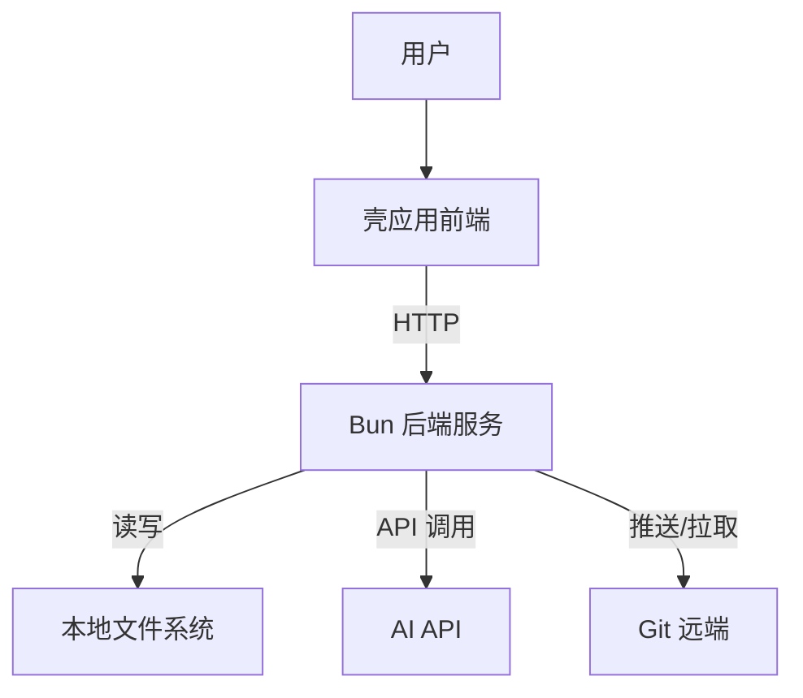
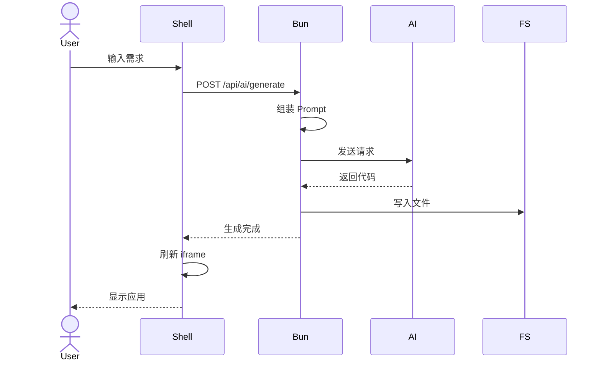
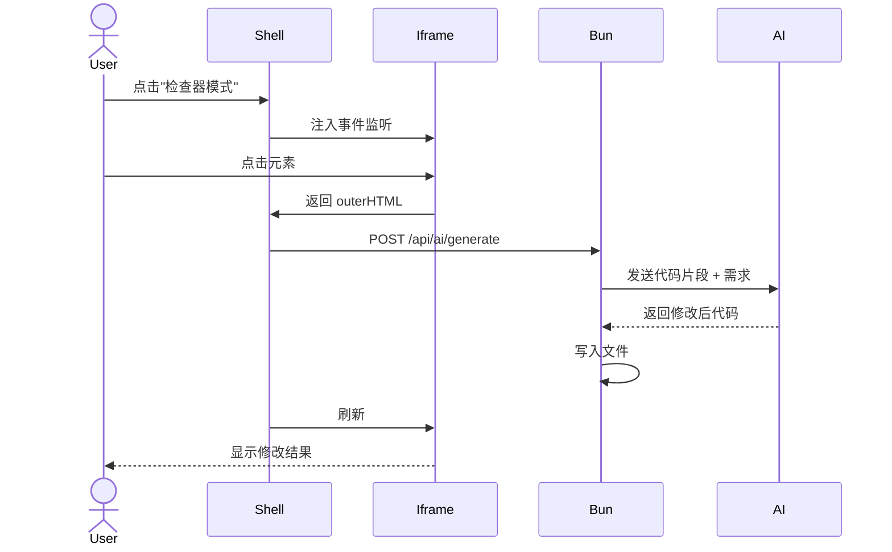

# Solution Design

**Document Version:** 1.0
**Last Updated:** 2026-01-17
**Status:** DRAFT
**Project Name:** Kura (蔵) - 本地化微应用生成与运行平台

---

## Executive Summary

Kura 采用"壳应用 + 微应用"的容器架构，通过 Bun 后端提供文件操作和 HTTP 服务，前端使用 Alpine.js + Tailwind 实现响应式界面。系统通过 AI 生成符合标准化规范的微应用代码，并利用 Import Maps 实现模块化代码复用。整个平台运行在本地，保护用户隐私，同时提供类似云端 SaaS 的便利性。

---

## Solution Overview

### Vision statement

构建一个本地优先的微应用平台，让用户能够通过 AI 快速创建、运行和管理满足个人特定需求的小型工具，就像传统的日式仓库（蔵）一样，安全、私密、触手可及。

### How it works

```
用户需求 → AI 生成代码 → 保存到本地 → 在浏览器中运行
    ↓           ↓            ↓           ↓
 自然语言   标准化模板   文件系统    iframe 隔离
```

**核心流程:**
1. 用户通过自然语言描述需求
2. AI 生成符合规范的代码 (index.html + logic.js + style.css)
3. 代码保存到本地文件系统
4. 在多标签页界面中运行应用
5. 支持 DOM 锚定进行精准修改

### Key differentiators

- **零依赖**: 无需 Node.js、无需构建流程
- **AI 友好**: 微应用只有 3 个文件，上下文小，生成质量高
- **本地优先**: 所有数据存储在本地，保护隐私
- **模块化**: @shared 模块系统实现代码复用
- **标准化**: 固定的技术栈，降低学习成本

---

## Core Components

### 1. Bun 后端服务

**目的:** 提供 HTTP 服务、文件操作、AI API 调用

**职责:**
- 启动 HTTP 服务器 (端口 3000)
- 处理静态文件请求
- 提供文件读写 API
- 代理 AI API 请求
- 执行 Git 命令
- 自动打开浏览器窗口

**关键特性:**
- 极快的性能 (Zig 编写)
- 零依赖 (内置打包、测试)
- 可编译成独立 EXE

### 2. 壳应用前端 (Dashboard)

**目的:** 提供用户界面，管理微应用生命周期

**职责:**
- 渲染多标签页界面
- 管理 AI 对话面板
- 实现 DOM 锚定功能
- 控制 iframe 显示和隐藏

**关键特性:**
- 使用 Alpine.js 实现响应式
- 使用 Tailwind + DaisyUI 统一样式
- x-show 实现 DOM 驻留，保持应用状态

### 3. 微应用标准模板

**目的:** 定义微应用的统一结构

**职责:**
- 提供标准化的 HTML 结构
- 导出业务逻辑 (ES Module)
- 可选的自定义样式

**标准结构:**
```
{app-name}/
├── index.html    # HTML + Tailwind 类 + Alpine 绑定
├── logic.js      # 纯业务逻辑 (ES Module export)
└── style.css     # (可选) 自定义样式
```

### 4. @shared 模块系统

**目的:** 提供公共代码复用机制

**职责:**
- 存储可复用的工具函数
- 提供统一的 API 调用封装
- 管理主题配置

**映射规则:**
```
/api/shared/*.js  →  /workspace/shared/*.js
```

**使用方式:**
```javascript
import { formatDate } from '@shared/date-utils.js';
```

### 5. AI 生成引擎

**目的:** 理解用户需求并生成符合规范的代码

**职责:**
- 解析用户需求描述
- 生成 Alpine.js + Tailwind 代码
- 处理错误反馈并修正

**强约束 DSL:**
- 必须使用 Alpine.js 语法
- 必须使用 Tailwind 类
- 必须导出 ES Module
- 不能使用 Node.js API

---

## Architecture

### System diagram



### Component interactions

| 从 | 到 | 交互类型 | 数据流 |
|------|-----|------------------|-----------|
| 用户 | 壳应用 | 点击事件 | 用户操作 |
| 壳应用 | Bun | HTTP 请求 | API 调用 |
| Bun | 文件系统 | 文件 I/O | 读写操作 |
| Bun | AI API | HTTPS POST | 代码生成 |
| 壳应用 | iframe | postMessage | 跨域通信 |

---

## Data Flow

### Primary flow - 微应用生成



### Primary flow - DOM 锚定修改



### Key data entities

| 实体 | 描述 | 关键字段 |
|--------|-------------|------------|
| 应用 | 微应用的基本信息 | id, name, icon, path |
| 标签页 | 标签页状态 | id, name, url, active |
| 模块 | 公共模块 | name, path, exports |
| 配置 | 工作区配置 | workspace, createdAt |

---

## Technical Approach

### Technology choices

| 技术 | 用途 | 理由 |
|------|---------|---------------|
| Bun | 运行时 | 极快性能、零依赖、内置打包 |
| Alpine.js | 前端框架 | 无需编译、文件极小、响应式强大 |
| Tailwind CSS | 样式库 | 实用优先、AI 友好、标准化 |
| DaisyUI | 组件库 | 基于 Tailwind、开箱即用 |
| Import Maps | 模块系统 | 浏览器原生、无需构建工具 |

### Implementation strategy

1. **阶段一: 基础框架**
   - 实现 Bun 后端服务
   - 实现壳应用主界面
   - 实现基本的文件操作

2. **阶段二: AI 生成**
   - 集成 AI API
   - 实现代码生成逻辑
   - 实现错误反馈机制

3. **阶段三: 高级功能**
   - 实现 DOM 锚定
   - 实现 Git 同步
   - 实现模块系统

### Integration points

| 系统 | 集成类型 | 说明 |
|--------|-----------------|-------|
| AI API | HTTPS POST | 需要用户配置 API Key |
| Git | 命令行调用 | 使用系统 git 命令 |
| 浏览器 | WebView | 使用 Edge --app 或 Electrobun |

---

## User Experience

### User journey

```
用户旅程:
[启动] → [打开应用] → [生成新应用] → [修改应用] → [同步到 Git]
  ↓         ↓            ↓            ↓           ↓
双击 EXE   点击标签    输入需求     点击元素    点击同步
```

### Key interactions

| 交互 | 描述 | 用户价值 |
|------|------|------------|
| 启动应用 | 双击 EXE，自动打开浏览器 | 一键启动，无需配置 |
| 切换标签 | 点击顶部标签栏 | 快速切换，状态保持 |
| 生成应用 | 在 AI 面板输入需求 | 5 分钟内从想法到可用 |
| DOM 锚定 | 点击界面元素进行修改 | 精准定位，避免歧义 |

### UI/UX considerations

- **简洁优先**: 界面最小化，突出应用内容
- **响应式**: 支持不同屏幕尺寸
- **原生感**: 尽可能接近原生应用的体验
- **反馈及时**: 所有操作都有即时反馈

---

## Security & Privacy

### Security measures

| 风险 | 缓解措施 |
|------|------------|
| 恶意代码 | 浏览器沙箱隔离 |
| 文件系统损坏 | Git 版本控制 |
| API Key 泄露 | 本地存储，不上传 |

### Privacy considerations

- 所有数据存储在本地
- 不向第三方发送用户代码 (除用户配置的 AI API)
- AI API Key 由用户本地管理

### Compliance

- 不涉及 GDPR (本地处理)
- 不涉及 CCPA (本地处理)

---

## Performance & Scalability

### Performance requirements

| 指标 | 目标 | 测量方式 |
|--------|--------|-------------|
| 应用加载时间 | < 2 秒 | 从点击到完全渲染 |
| 标签切换时间 | < 100ms | 从点击到内容显示 |
| AI 生成响应 | < 10 秒 | 从提交到代码返回 |

### Scalability approach

- 支持同时打开至少 10 个微应用
- 支持工作区包含至少 100 个微应用
- 支持至少 50 个 @shared 公共模块

### Capacity planning

| 资源 | 预期 | 最大值 | 缓冲 |
|----------|----------|---------|--------|
| 标签页数量 | 5-10 个 | 50 个 | 自动销毁旧标签 |
| 应用数量 | 20-50 个 | 100 个 | 文件系统限制 |
| 模块数量 | 10-20 个 | 50 个 | 性能考虑 |

---

## Trade-offs & Considerations

### Design trade-offs

| 权衡 | 选择 | 理由 |
|------|--------|---------------|
| 性能 vs 易用性 | 易用性优先 | 目标用户更关心易用性 |
| 标准化 vs 灵活性 | 标准化优先 | 便于 AI 生成和维护 |
| 本地 vs 云端 | 本地优先 | 保护数据隐私 |

### Limitations

- 需要现代浏览器支持 (Chrome 89+, Safari 16.4+)
- 受限于 AI 模型的代码生成能力
- 单机使用，不支持多用户协作
- 受限于本地文件系统性能

### Assumptions

- 用户有稳定的网络连接以访问 AI API
- 用户愿意安装本地程序
- 用户有一定的计算机操作能力

---

## Alternatives Considered

### Evaluated options

| 选项 | 优点 | 缺点 | 未选择原因 |
|------|------|------|------------|
| Electron | 成熟生态 | 体积大、资源占用高 | 太重 |
| 纯 Web 应用 | 无需安装 | 功能受限 | 无法访问本地文件 |
| Tauri | 轻量、高性能 | 需要 Rust 知识 | 学习曲线陡峭 |
|云端 No-Code 平台 | 功能强大 | 数据隐私问题 | 不符合本地优先 |

---

## Risks & Mitigation

| 风险 | 影响 | 概率 | 缓解措施 |
|------|--------|-------------|------------|
| AI 生成质量不稳定 | 高 | 中 | 强约束 DSL + 代码模板 |
| 用户浏览器不支持 | 高 | 低 | 兼容性检测 + 降级方案 |
| 内存占用过高 | 中 | 中 | 自动销毁旧标签 |
| AI API 成本过高 | 中 | 低 | 支持用户自备 API Key |

---

## Open Questions

| 问题 | 优先级 | 负责人 |
|------|--------|-------|
| 使用哪个 AI 模型？ | P0 | 待定 |
| 如何实现增量修改？ | P1 | 待定 |
| 是否支持离线模式？ | P2 | 待定 |
| 模块市场的商业模式？ | P2 | 待定 |
